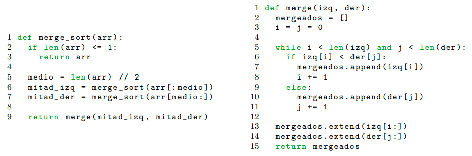
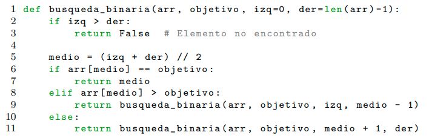

# Ejercicio 1 (Merge Sort)



## 1. Identificar qué lineas son el divide, cuáles son el conquer y cuáles el combine.

- Divide: 5.
- Conquer: 6 y 7
- Combine: 9 (merge)

## 2. ¿En cuántos subproblemas se divide?

Se divide en 2 subproblemas, `arr[:medio]` y `arr[medio:]`

## 3. ¿De qué tamaño son estos subproblemas?

Los subproblemas son de tamaño $\frac{n}{2}$, ya que cada vez que hacemos la recursión, el array se reduce a la mitad.

## 4. ¿Cuál es el costo de combinar los resultados de los subproblemas?

Si vamos al inciso 1, sabemos que la linea encargada de combinar los resultados es la 9, la funcion merge. Si analizamos la función `merge`, vemos que en el peor caso recorremos ambas listas por completo. Por lo tanto, el costo es de $O(n)$

## 5. Escribir la función $T(n)$ de manera recursiva.

- $a$: Cantidad de subproblemas = 2
- $c$: Factor de reducción del tamaño del subproblema: 2
- $f(n)$: Costo de dividir y combinar resultados: $O(n)$
- $n_0$: Tamaño base del problema: 1

$$
T(n) =
\begin{cases}
\Theta(1) & n \le n_0 \quad \\
2\,T\!\left(\dfrac{n}{2}\right) + \Theta(n) & n > n_0
\end{cases}
$$

## 6. Determinar la complejidad del algoritmo utilizando el Teorema Maestro.

Ya tenemos $a$, $c$ y $f(n)$. Comparamos $f(n)$ con $n^{\log_{c}a}$.

Analicemos los casos:

- **Caso 1:**:
  Elegimos $\varepsilon$ = 0.1. ¿$\Theta(n) = O(n^{(\log_{c}{2})-0.1})$? No. Por lo tanto, pasamos al **Caso 2**.
- **Caso 2:**:
  $\Theta(n) = \Theta(n^{\log_{2} 2}) \equiv$
  $\Theta(n) = \Theta(n)$. Entonces la complejidad es:
  $T(n) = \Theta(n \cdot \log \ n)$

# Ejercicio 2 (Búsqueda Binaria)



## 1. Identificar qué lineas son el divide, cuáles son el conquer y cuáles el combine.

- Divide: 5.
- Conquer: 9 y 11, las llamadas recursivas.
- Combine: $\Theta(1)$. No hay una combinación como tal.

## 2. ¿En cuántos subproblemas se divide?

Se divide en un subproblema. Como vemos, realizamos la llamada recursiva como mucho una vez.

## 3. ¿De qué tamaño son estos subproblemas?

Son de tamaño $\frac{n}{2}$. Como vemos, cada vez que hacemos la recursión, el valor de `der - izq` se reduce a la mitad con respecto al paso anterior.

## 4. ¿Cuál es el costo de combinar los resultados de los subproblemas?

Como dijimos anteriormente, no hay que combinar nigún resultado.

## 5. Escribir la función $T(n)$ de manera recursiva.

- $a$: Cantidad de subproblemas = 1
- $c$: Factor de reducción del tamaño del subproblema: 2
- $f(n)$: No hay que combinar ningún resultado = $\Theta(1)$
- $n_0$: 1

$$
T(n) =
\begin{cases}
\Theta(1) & n \le n_0 \quad \\
T\!\left(\dfrac{n}{2}\right) + \Theta(1) & n > n_0
\end{cases}
$$

## 6. Determinar la complejidad del algoritmo utilizando el Teorema Maestro.

Comparamos $f(n) \ (\Theta(1))$ con $O(n^{\log_2{1}})$

- **Caso 1:**
  Elegimos $\varepsilon$ = 0.1. ¿$\Theta(1) = O(n^{(\log_{2}{1})-0.1})$? No. Pasamos al **Caso 2**.
- **Caso 2:**
  ¿$\Theta(1) = \Theta(n^{\log_{2} 1})$? Si, ya que $\log_{x} 1 = 0 \ \forall \ x \in \mathbb{N}$.
  Por lo tanto la complejidad es: $\Theta(n^{log_{2} 1} \cdot \log \ n) \equiv \Theta(\log \ n)$

# Ejercicio 3 (Izquierda Dominante)

Dado un arreglo de tamaño $2^k, k \in \mathbb{N}$, queremos determinar si este es *más a la izquierda*.

Un arreglo es *más a la izquierda* si:

- La suma de los elementos de la mitad izquierda superan los de la mitad derecha.
- Cada una de las mitades es a su vez *más a la izquierda*.

```cpp
bool overloadMasALaIzquierda(vector<int> &array, size_t start, size_t end) {
    int length = end - start + 1;
  
    // Caso Base
    if (length == 2) return (array[start] > array[end]);

    // Caso Recursivo
    int mid = (length / 2) - 1 + start;

    int sumLeft  = std::accumulate(array.begin() + start, array.begin() + (mid + 1), 0);
    int sumRight = std::accumulate(array.begin() + (mid + 1), array.begin() + (end + 1), 0);

    return (
        sumLeft > sumRight && 
        overloadMasALaIzquierda(array, start, mid) &&
        overloadMasALaIzquierda(array, mid + 1, end)
    );
}

bool masALaIzquierda(vector<int> &array) {
    return overloadMasALaIzquierda(array, 0, array.size() - 1);
}
```

Veamos cuál es nuestra complejidad.

- $a$: Cantidad de llamados recursivos = 2
- $c$: Factor de reducción del tamaño del subproblema = 2
- $f(n)$: Costo de dividir y combinar resultados = $\Theta(n)$. Esto es así ya que hay que hacer la sumatoria del lado izquierdo y el lado derecho del arreglo.
- $n_0$: Tamaño base del problema = 1

Comparamos $f(n)$ con $n^{\log_{c} a}$

- **Caso 1:**
  Elegimos $\varepsilon = 0.1$. ¿$\Theta(n) = O(n^{(\log_{2}{2})-0.1})$?. No. Seguimos con el **Caso 2**.
- **Caso 2:**
  ¿$\Theta(n) = O(n^{\log_{2}{2}})$?. Si. Por lo tanto la complejidad es: $\Theta(n \cdot log \ n)$

Notemos que $\Theta(n \cdot log \ n) \lt O(n^2)$.

# Ejercicio 4 (Índice Espejo)

Tenemos un arreglo *estrictamente creciente* de enteros. Queremos determinar si existe un indice $i$ tal que $a_i = i$.

```cpp
void overloadIndiceEspejo (vector<int> &array, size_t start, size_t end, int &result) {
    // Escribe en result:  i si existe un i tal que array[i] = i
    // Si no existe un i tal que array[i] = i, no modifica el valor de result
    if (result != -1) return;

    int length = end - start + 1;

    // Caso base
    if (length == 1) {
        if (array[start] == start) {
            result = start;
        }
        return;
    }

    // Caso recursivo
    int mid = start + (length + 1) / 2 - 1;  // ceil(length/2) - 1 + start
    if (array[mid] == mid) {
        result = mid;
        return;
    } else if (array[mid] > mid) {
        overloadIndiceEspejo(array, start, mid, result);
    } else if (array[mid] < mid) {
        overloadIndiceEspejo(array, mid + 1, end, result);
    }
}

int indiceEspejo(vector<int> &array) {
    // Devuelve i tal que array[i] = i. Si no existe:
    // Devuelve -1 si no existe un i tal que array[i] = i
    int result = -1;
    overloadIndiceEspejo(array, 0, array.size() - 1, result);
    return result;
}
```

Veamos la complejidad de nuestro algoritmo.

- $a$: Cantidad de subproblemas = 1
- $c$: Factor de reducción del tamaño del subproblema = 2
- $f(n)$: $\Theta(1)$
- $n_0$: 1

Comparamos $f(n) \ (\Theta(1))$ con $n^{\log_{c}{a}}$

- **Caso 1:**
  Tomamos $\varepsilon = 0.1$. ¿$\Theta(1) = O(n^{(\log_{2}{1})-0.1})$?. No, seguimos con el **Caso 2**.
- **Caso 2:**
  ¿$\Theta(1) = O(n^{log_{2}{1}})$?. Si, pues $O(n^{log_{2}{1}}) = O(n^0) = O(1)$.
  Entonces la complejidad es $\Theta(n^{log_{2}{1}} \cdot \log \ n) = \Theta(\log \ n)$

# Ejercicio 5 (Potencia Logarítmica)

Queremos calcular $a^b$ en tiempo logarítmico en b. Pensemos cómo se calcula una potencia e intentemos ver como podemos usar *Divide & Conquer*.

Por ejemplo, calcular $2^8$. Entonces: $2^8 = 2^4 \times 2^4$. Entonces queremos saber cuál es el resultado de $2^4$. Nuevamente usando propiedades de la multiplicación/potenciación, sabemos que $2^4 = 2^2 \times 2^2$. Vemos cómo podemos calcular una potencia grande, calculando las mas chicas.

```cpp
int potenciaLogaritmica(int base, int potencia) {
    // Casos Base
    if (potencia == 1) return base;
    if (potencia == 0) return 1;

    // Caso Recursivo
    if (potencia % 2 == 0) {
        int rec = potenciaLogaritmica(base, potencia / 2);
        return rec * rec;
    } else {
        int rec = potenciaLogaritmica(base, floor(potencia / 2));
        return rec * (rec * base);
    }
}
```

Calculemos la complejidad usando el *Teorema Maestro*.

- $a$: Cantidad de llamados recursivos = 1
- $c$: Factor de reducción del subproblema = 2
- $f(n)$: $\Theta(1)$
- $n_0$: 1

Comparamos $f(n) \ (\Theta(1))$ con $n^{\log_{c}{a}}$

- **Caso 1:**
  Tomamos $\varepsilon = 0.1$. ¿$\Theta(1) = O(n^{(\log_{2}{1})-0.1})$?. No. Seguimos con el **Caso 2**.
- **Caso 2:**
  ¿$\Theta(1) = \Theta(n^{\log_{2}{1}})$? Si. Entonces la complejidad es:
  $O(n^{\log_{2}{1}} \cdot \log \ n) = \Theta(\log \ n)$

# Ejercicio 6

Tenemos un arreglo que es estrictamente creciente hasta determinado punto, y a partir del mismo, estrictamente decreciente. Queremos encontrar el elemento de mayor valor en dicho arreglo en complejidad $O(\log \ n)$.

```cpp
int overloadMaximoMontaña(vector<int> &array, int start, int end) {

    int length = end - start + 1;

    // Caso Base
    if (length == 1) return array[start];
    if (length == 2) {
        if (array[start] < array[end]) return array[end];
        return array[start];
    }
    
    // Caso Recursivo
    int mid = (length / 2) - 1 + start;

    if (array[mid - 1] < array[mid]) {
        return overloadMaximoMontaña(array, mid, end);
    } else {
        return overloadMaximoMontaña(array, start, mid - 1);
    }
}

int maximoMontaña(vector<int> &array) {
    return overloadMaximoMontaña(array, 0, array.size() - 1);
}
```

Analicemos la complejidad utilizando el *Teorema Maestro*.

- $a$: Cantidad de llamados recursivos = 1
- $c$: Factor de reducción del tamaño del subproblema = 2
- $f(n)$: $\Theta(1)$
- $n_0$: 1

Comparamos $f(n)$ con $n^{\log_{c}{a}}$

- **Caso 1:**
  Tomamos $\varepsilon = 0.1$ ¿$\Theta(1) = O(n^{(\log_{2}{1})-0.1})$? No. Seguimos con el **Caso 2**.
- **Caso 2:**
  ¿$\Theta(1) = O(n^{\log_{2}{1}})$? Si. Entonces la complejidad queda:
  $\Theta(n^{\log_{2}{1}} \cdot  \log \ n) = \Theta(\log \ n)$


