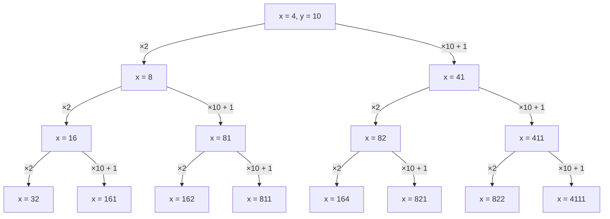

# [Convertibilidad](https://codeforces.com/group/yuAAIJ8c1R/contest/631549/problem/B)

Tenemos un numero $x$ y lo queremos convertir en un número $y$.

Para esto, podemos realizar dos operaciones:
- $x = x \times 2$
- $x = x \times 10 + 1$

Queremos primero, encontrar si podemos convertir $x$ en $y$. Pensemos en qué casos NO es posible convertir $x$ en $y$.

Elijamos un $x$ y un $y$ arbitrarios y simulemos los distintos pasos.

Como vemos, $x$ es estrictamente creciente. Esto se debe a que el input de $x$ es mayor o igual a 1 y las operaciones son productos con numeros positivos y sumas con positivos. Sabiendo esto, una vez que recibamos un $x$ mayor a $y$, podemos dejar de buscar.
